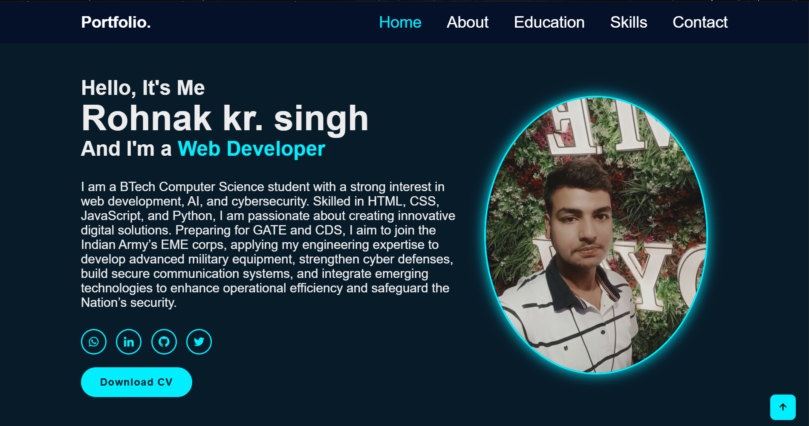
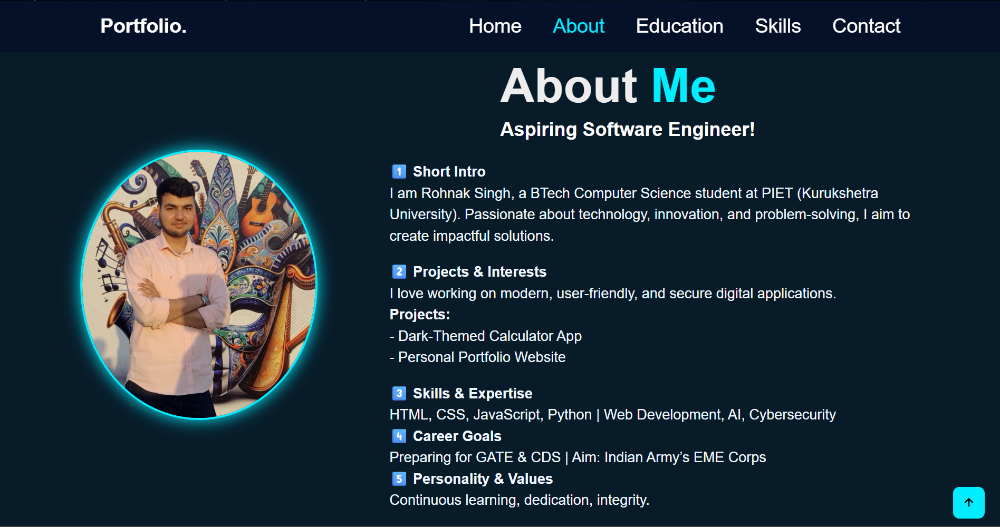
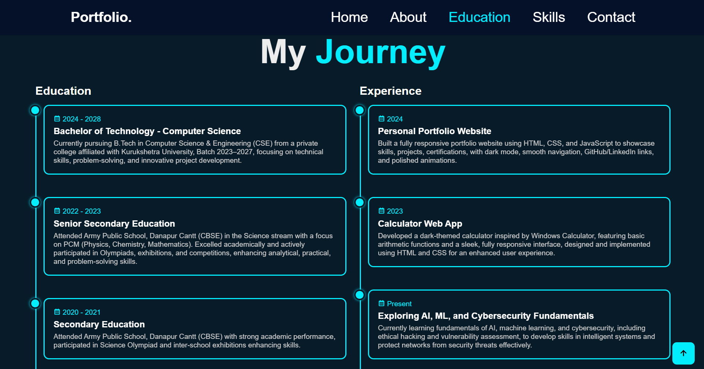
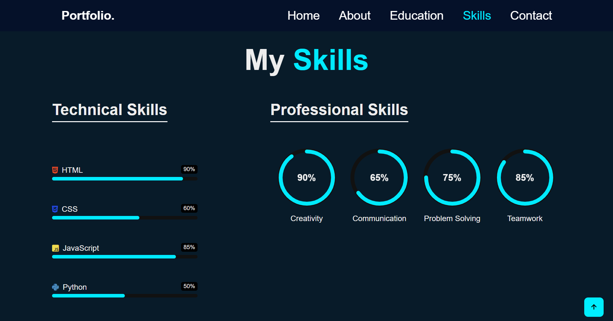
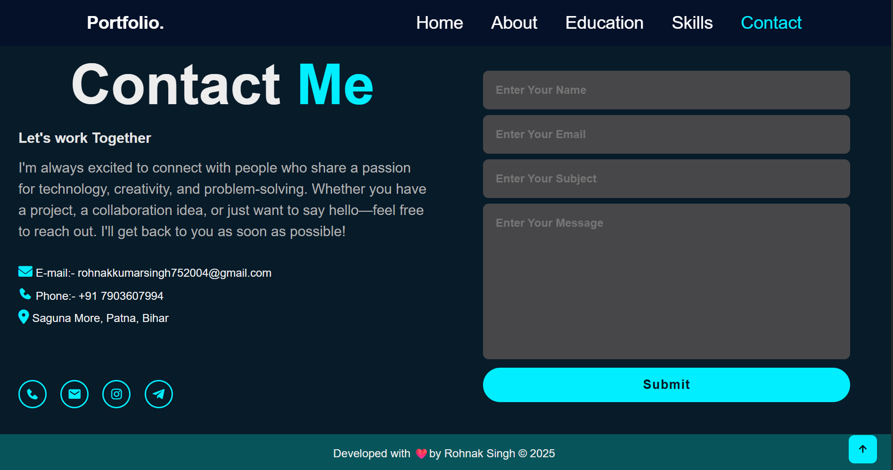

# 🌐 Personal Portfolio Website  


---

## 📌 Project Overview  
This is my **personal portfolio website**, built as part of **CodSoft Web Development Internship – Level 1 (Task 1)**.  

It contains **5 responsive sections**:  
- 🏠 **Home** – Introduction and hero section  
- 👤 **About** – My background and goals  
- 📖 **My Journey** – Education & Experience timeline  
- 💡 **Skills** – Technical expertise  
- ✉️ **Contact Me** – Easy way to connect  

---

## 🔗 Live Demo  
👉 **[Click here to view my portfolio](https://rohnak07.github.io/codsoft_task1_portfolio/)**  

---

## ✨ Features  
- ✅ Fully **responsive design** (mobile, tablet, desktop)  
- ✅ **Smooth scrolling navigation**  
- ✅ **Interactive UI** with clean layout  
- ✅ **Downloadable Resume (PDF)** included  
- ✅ Easy to update & customize  

---

## 🛠️ Tech Stack  
- **HTML5** – Structure & Layout  
- **CSS3** – Styling, Animations, Responsive Design  
- **JavaScript (Vanilla JS)** – Interactivity & Functions  

---

## 📂 Project Structure  
<pre> ``` codsoft_task1_portfolio/
├── 📁 Screenshot/
│ ├── 🏠 Home.png
│ ├── 👤 About.png
│ ├── 🛠 Skills.png
│ ├── 🎓 Education.png
│ └── 📞 Contact.png
│
├── 📄 index.html # Main portfolio webpage (HTML structure)
├── 🎨 style.css # Styling & responsive design (CSS)
├── ⚡ main.js # JavaScript for interactivity
├── 🖼 profile.jpg # Profile photo
├── 📑 Rohnak_CV.pdf # Resume (downloadable)
├── 📝 README.md # Documentation file
└── 🖼 IMG_20250308_175546.jpg # Extra image (optional)``` </pre>


---

## 🚀 Run Locally  
1. Clone the repository  
   ```bash
   git clone https://github.com/Rohnak07/codsoft_task1_portfolio.git


Navigate to the project folder <br>
cd codsoft_task1_portfolio

Open index.html in your browser


## 📸 Screenshots  

### 🏠 Home Page  
  

### 👤 About Section  
  

### 🎓 Education Section  
 

### 🛠 Skills Section  
  

### 📞 Contact Section  
 

<br>
<br>
<br>
👨‍💻 Author
<br>
  Rohnak Singh
<br>
📧 Email: rohnakkumarsingh752004@gmail.com
<br>
💼 LinkedIn: [www.linkedin.com/in/rohnaksingh](https://www.linkedin.com/in/rohnaksingh)
<br>
🌐 GitHub: [https://github.com/Rohnak07](https://github.com/Rohnak07)
<br>
📄 📄 [View My CV](https://drive.google.com/file/d/1UC9H4ic3ZsaOeTGE2-FmFe6_kDoAVVtI/view?usp=drivesdk)
<br>
<br>
<br>
📜 License
<br>
This project was created as part of the CodSoft Internship (Level 1 – Task 1).
You are free to use it for learning and portfolio purposes.

